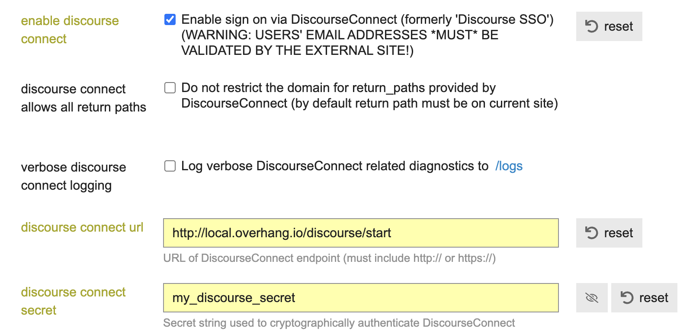

# Discourse Open edX SSO Connector

**Note: This is still in beta, please use with cautious.**

This was tested on the following: 
Discourse: 2.9.0
Open edX: Nutmeg
tutor: 14.0.1

The purpose of this project is exactly the following: 

_You are using Open edX and you want to use discourse.org as place where learners and teachers can communicate. **But you don't want the users to have two accounts, for the  open edx and  discourse forum**_

By using this plugin, you can let your Open edX utilize, the SSO (single-sign-on) of discourse, thus when users access the forum they will be redirected to the LMS to authticate, and then redirect back the forum if success.

## Set up in Open edX


### Intalling
Just like any other open edx plugin app, you would just need install by running `pip install discourse-openedx-sso` in the LMS python env. 


### Configuration
There are two main settings, this plugins needs, one is required and the other is optional. 

`DISCOURSE_SECRET`: is required and should be at least 10 characters, and it should match the secret in discourse settings. 
`DISCOURSE_VALIDATE_EMAIL`: is not required by deafult its `False`, settings this to `True` implies validting email address for users, it setted to `False` because its expected users where already validated through Open edX. 
The settings is added in lms, e.g either common or production. 

```python
DISCOURSE_SECRET = 'my_discourse_secret'
DISCOURSE_VALIDATE_EMAIL = False # By deafult its False.
```

## Example configuration and setup with tutor:

Tip, if you are using tutor you could set these settings as well as installing by creating a plugins file:

Create a file with the following name/path: `"$(tutor plugins printroot)"/discourse_sso.py`

Content of the file: 
```
from tutor import hooks 
hooks.Filters.ENV_PATCHES.add_items([
    (
        "openedx-lms-common-settings",
        """
DISCOURSE_SECRET = "my_discourse_secret"
"""
    ),
    (
        "openedx-dockerfile-post-python-requirements",
        """
RUN pip install git+https://github.com/zaatdev/discourse-openedx-sso
"""
    ),
])

```

`tutor config plugins enable sso` # to enable the plugin
`tutor config save` # to reneder template 
Note: **I really recommend to debug** that tutor plugin is applied (because building the docker image takes a lot of time):
If you run `cd "$(tutor config printroot)"/env && grep -r discourse "$(tutor config printroot)"/env` after following the above steps, you should get something like: 
```bash
apps/openedx/settings/lms/production.py:DISCOURSE_SECRET = "my_discourse_secret"
apps/openedx/settings/lms/development.py:DISCOURSE_SECRET = "my_discourse_secret"
build/openedx/Dockerfile:RUN pip install discourse-openedx-sso
```
`tutor images build openedx` # Is needed so the plugin is installed in tutor openedx docker image. 

## How to set it up in discourse

- Go to the site admin settings, and then choose login tab and
- set the discourse connect url to be: `https://yourlms.com/discourseconnect/start` _Note if you are using tutor dev it would exactly `http://local.overhang.io/discourse/start`_
- Set discourse connect secret at least 10 chractser e.g. `my_discourse_secret` Note: need to use for following steps. 
- check enable discourse connect checkbox, But before:

Important: **Make sure the email SMTP service is working in discourse, so that in case of trouble you can still login as an admin**. 




For more information, check [this post on meta.discourse.org](https://meta.discourse.org/t/discourseconnect-official-single-sign-on-for-discourse-sso/13045)


## Similar projects
- To connect wordpress with discourse https://wordpress.org/plugins/wp-discourse/ 